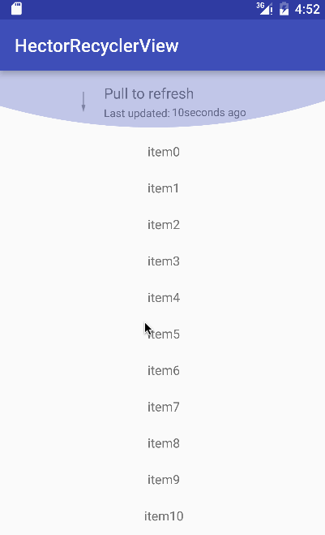
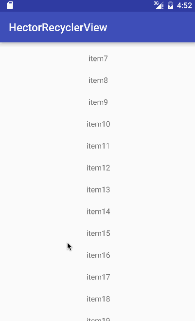

# HectorRecyclerView
A RecyclerView that implements pull to refresh and load more, it also supports auto refresh.

## Samples
### Refresh

### LoadMore

## Usage

The usage is as same as the general recyclerview.

### Notice
#### SetListener

	hectorRecylerView.setListener(new HectorRecyclerView.RefreshListener() {                         
            @Override
            public void refresh() {}

            @Override
            public void loadMore() {}
         );
         
#### Auto refresh

	hectorRecyclerView.autoRefresh();
	
## Contact me:
hector1990.troy@gmail.com

## License
<pre>Copyright 2015 Hector1990

Licensed under the Apache License, Version 2.0 (the "License");
you may not use this file except in compliance with the License.
You may obtain a copy of the License at

   http://www.apache.org/licenses/LICENSE-2.0

Unless required by applicable law or agreed to in writing, software
distributed under the License is distributed on an "AS IS" BASIS,
WITHOUT WARRANTIES OR CONDITIONS OF ANY KIND, either express or implied.
See the License for the specific language governing permissions and
limitations under the License.</pre>
